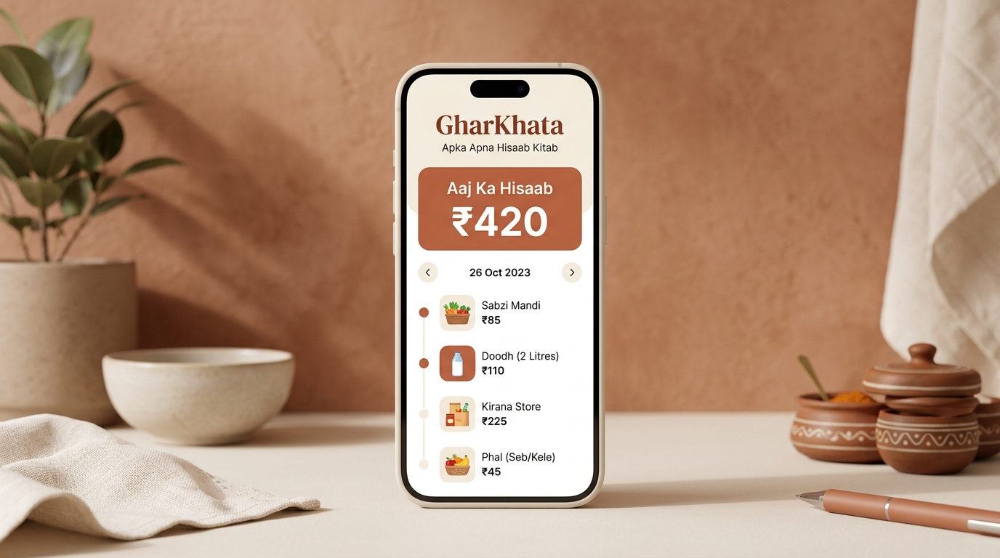
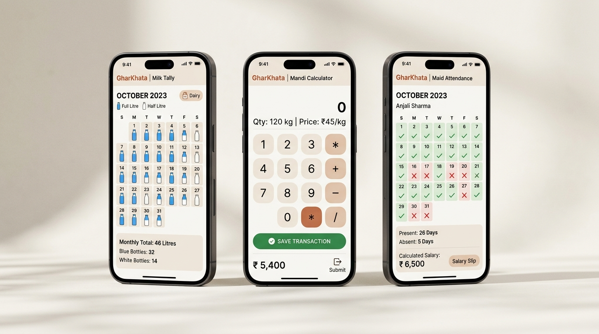

# GharKhata (घरखाता): Minimalist Offline Household Ledger

<p align="center">
  
</p>

<p align="center">
  <strong>GharKhata: Apka Apna Hisaab Kitab</strong><br>
  <em>100% Offline • Zero Clutter • Privacy-First Household Ledger for Homemakers</em>
</p>

<p align="center">
  
  
  
  
  
</p>

<p align="center">
  
</p>

---

## 📖 Overview

**GharKhata (घरखाता)** is a high-finish, **100% offline-first household ledger, milk delivery tally, and budget tracker** crafted specifically for homemakers (*Home CFOs*). Built natively with modern declarative UI frameworks (**Jetpack Compose** on Android and **SwiftUI** on iOS), GharKhata replaces corporate accounting jargon with **visual recognition, voice logging, and 3-tap ergonomics**—all with **zero internet permissions**, **no login barriers**, and **zero subscription fees**.

---

## 🌸 Why GharKhata?

Most personal finance apps are engineered for corporate accountants—filled with English dropdowns, bank SMS scrapers, and double-entry terminology (*Assets, Liabilities, Reconciliation*). 

GharKhata addresses the real-world daily financial workflows of Indian households:
1. **Cash & UPI Blend**: Vegetable markets, milkmen, and small vendors operate in cash and micro-UPI.
2. **Visual Recognition Over Text**: Big, unmistakable icons (🥦 Sabzi, 🌾 Kirana, 🥛 Doodh, 🧹 Bai) require zero English reading.
3. **Automated Household Math**: Eliminates manual calculations for daily spending limits, milkman bills, and maid leaves/salary advances.
4. **100% Private & Free**: Complete privacy with zero internet permissions. What happens in the household stays on the device.

---

## 🚀 Key Features

<p align="center">
  
</p>

### 1. "Aaj Ka Kharcha" (Dynamic Daily Spending Limit)
* **Real-time Pacing**: Automatically calculates how much can safely be spent today based on the monthly household budget:
  $$\text{Daily Safe Spend} = \frac{\text{Monthly Budget} - \text{Total Spent Till Today}}{\text{Days Remaining in Month}}$$
* **Adaptive Allocation**: Spending less today automatically increases the safe limit for tomorrow.

### 2. Mandi Math Pad (Integrated Calculator Keypad)
* **Running Additions**: In Indian vegetable markets, bills come as multiple small items (`40 + 60 + 35 + 20`).
* **Zero Lag (0ms)**: Direct on-screen calculation with `+` and `-` keys right on the numeric entry pad. No switching between calculator apps.
* **Emil Kowalski Tactile Polish**: Spring-based key depression (`scale(0.96)`) paired with crisp hardware haptic feedback.

### 3. "Doodh Ka Hisaab" (Visual Bottle Tally)
* **1-Tap Calendar Grid**: Visual milk bottles defaulting to daily consumption (e.g. `1.0 L @ ₹66/L`).
* **Instant Toggle**: Tap a date to switch: `1.0L` $\rightarrow$ `1.5L` $\rightarrow$ `2.0L` $\rightarrow$ `0L (Bandh)`.
* **Automated Month-End Total**: Continuously calculates total liters and exact rupee bill.
* **1-Tap WhatsApp Summary**: Generates a pre-formatted message to verify the monthly tally with the milkman.

### 4. "Kamwali / Bai" Payroll & Advance Deductor
* **Visual Attendance Calendar**: Tap to mark 🟢 **Aayi (Present)** or 🔴 **Chhutti (Absent)**.
* **Advance Tracking**: Dedicated `+ Advance Diya` button to record mid-month cash advances.
* **Auto-Prorated Salary**: Automatically calculates net payable salary on the 1st:
  $$\text{Net Salary} = \left(\frac{\text{Monthly Salary}}{\text{Days in Month}} \times \text{Present Days}\right) - \text{Advance Taken}$$
* **WhatsApp Salary Slip**: Sends a clear bilingual breakdown directly to the domestic helper.

### 5. "Gupt Tijori" (Secret Savings Vault)
* **Biometric PIN Protection**: A private, isolated vault for personal emergency cash reserves (*Stree Dhan*) and festival cash gifts.
* **Strict Isolation**: Hidden from the main dashboard and never included in exported family reports.

### 6. "Galla" Cash Denomination Counter
* Rapid steppers for physical Indian currency notes ($₹500, ₹200, ₹100, ₹50, ₹20, ₹10$) that auto-calculate the total physical cash in the home almirah or purse.

---

## 🏗️ Technical Architecture

| Dimension | Android (`/app`) | iOS (`/iosApp`) |
| :--- | :--- | :--- |
| **Language** | Kotlin 2.0+ / JVM 17 | Swift 5.9+ |
| **UI Framework** | Jetpack Compose + Material 3 | SwiftUI |
| **Local Storage** | Room Database (SQLite) + DataStore | CoreData / Local JSON Store |
| **Haptics** | AndroidX HapticFeedbackConstants | UIImpactFeedbackGenerator |
| **Biometrics** | AndroidX `BiometricPrompt` | iOS `LocalAuthentication` (Face ID / Touch ID) |
| **Currency** | Indian Rupee (`₹` Lakhs/Crores format) | Indian Rupee (`₹` Lakhs/Crores format) |
| **Network** | **Zero Permissions (`INTERNET` omitted)** | **Zero Network Calls** |

---

## 📁 Repository Structure

```
gharkhata/
├── app/                                 # Native Android Application
│   ├── src/main/AndroidManifest.xml     # Zero-internet privacy manifest
│   ├── src/main/java/com/gharkhata/app/
│   │   ├── core/
│   │   │   ├── database/               # Room SQLite entities, DAOs, & forward migrations
│   │   │   ├── designsystem/           # Warm terracotta & bone theme, Emil Kowalski tactile modifiers
│   │   │   └── util/                   # AutoCalculators, INR formatter, WhatsApp slip generators
│   │   ├── domain/model/               # Domain models (Transaction, MilkLog, Staff, CashGalla)
│   │   ├── ui/                         # Compose screens (HomeScreen, ServicesScreen, SavingsScreen)
│   │   ├── MainActivity.kt             # Activity with WhatsApp intent dispatcher
│   │   └── GharKhataApplication.kt
│   ├── src/test/java/com/gharkhata/app/ # 100% Unit test suite for all calculation engines
│   └── build.gradle.kts
│
├── iosApp/                              # Native iOS Application
│   ├── GharKhata/
│   │   ├── App/                        # SwiftUI @main entry point & ContentView
│   │   ├── Domain/                     # Swift domain models matching Android parity
│   │   └── Core/                       # Swift AutoCalculators & INR formatters
│   └── README.md
│
├── docs/
│   ├── images/                         # High-resolution hero banner & UI showcases
│   ├── UX_DESIGN_PRINCIPLES.md         # Non-tech ergonomics & 3-tap interaction flow
│   ├── DATABASE_SCHEMA.md              # Offline Room/SQLite schema documentation
│   ├── CROSS_PLATFORM_UI_POLISH.md     # Taste & Emil Kowalski design engineering guide
│   └── OFFLINE_LOCALIZATION_AND_BACKUPS.md # Multi-language & zero-cost backup architecture
│
├── .github/workflows/ci.yml             # GitHub Actions CI for builds and tests
├── CHANGELOG.md                         # Release notes & version history
├── CONTRIBUTING.md                      # Contribution guidelines
├── SECURITY.md                          # Zero-trust privacy policy
├── LICENSE                              # MIT License
└── README.md
```

---

## 🛠️ Build & Setup Instructions

### Android Build
```bash
# Verify unit tests (100% pass rate)
./gradlew test

# Compile Kotlin sources
./gradlew compileDebugKotlin

# Build debug APK
./gradlew assembleDebug
```
The resulting APK is generated at:
`app/build/outputs/apk/debug/app-debug.apk`

---

## 📄 License

GharKhata is released under the [MIT License](file:///home/ubuntu/website_data/gharkhata/LICENSE).  
Copyright © 2026 pronextlabs.
