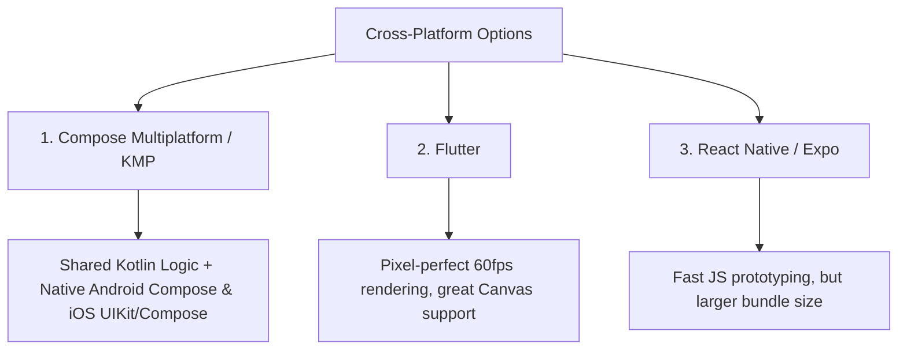

# Cross-Platform Architecture & Emil Kowalski UI/UX Polish

---

## 1. Design Read & Aesthetic Foundation (Taste Skill)

> **Design Read**: *"A warm, dignified, tactile utility for Indian homemakers, with an organic handcrafted editorial aesthetic, leaning toward soft terracotta/bone tones, tabular numerals, and zero tech-jargon."*

* **Dials**: `DESIGN_VARIANCE: 5` | `MOTION_INTENSITY: 3` (restrained, intentional) | `VISUAL_DENSITY: 3` (room to breathe, large touch zones).
* **Anti-Slop Guardrails**:
  * ❌ No generic neon/purple AI gradients or dark crypto-style dashboards.
  * ❌ No dense spreadsheets, generic thin-line icon packages, or tiny dropdowns.
  * ✅ Warm, natural palette: Bone White canvas (`#FDFBF7`), Terracotta brand accent (`#C45B3E`), Olive/Forest Green for inflow (`#2E6F40`), Soft Clay Rose for outflow (`#A8382B`), Deep Charcoal typography (`#23211E`).
  * ✅ Tabular figures (`tnum`) for all currency displays so changing numbers never cause layout jitter.

---

## 2. Emil Kowalski UI Polish & Micro-Interaction Review

| Before | After | Why (Design Engineering Rationale) |
| :--- | :--- | :--- |
| Generic `Toast.makeText()` floating over buttons | Bottom-anchored pill with `HapticFeedback.Success` + 5s Undo CTA | Toasts must feel attached to the action surface and be reachable by the thumb without blocking content |
| `AnimatedVisibility(fadeIn + slideInVertically)` on keypad digits | **0ms instantaneous render** on keyboard taps | Never animate repetitive data-entry actions; animation makes frequent typing feel sluggish |
| Bottom sheet snaps with linear/ease-in curve | Spring-based drawer with `cubic-bezier(0.32, 0.72, 0, 1)` | Mimics natural physical inertia and finger velocity on dismissal |
| Currency jumps horizontally when numbers change | `font-variant-numeric: tabular-nums` (Monospace numerals) | Prevents layout shift and ocular fatigue during rapid additions |
| `IconButton` with default 40dp padding | 64×64 dp touch target with `transform: scale(0.96)` on `:active` | Ensures confident tapping with wet or busy hands in kitchen settings |
| Full-screen red error banner on overspending | Soft amber card with positive framing: *"Today's safe spend adjusted to ₹310"* | Avoids anxiety and shame-inducing UI; finances should feel empowering, not punitive |

---

## 3. Cross-Platform Framework Recommendation

To maintain the **100% offline, zero-cloud-bill, and lightweight (<15MB)** philosophy of TutorHQ, we evaluate three cross-platform approaches:

### Recommendation: **Compose Multiplatform (Kotlin Multiplatform - KMP)**
1. **Direct Lineage with TutorHQ**: Leverages the exact same Room/SQLite patterns, Kotlin coroutines, and declarative UI already structured in `tutapp`.
2. **True Native Performance**: Compiles to native JVM bytecode on Android and LLVM native machine code on iOS via Kotlin/Native.
3. **Shared Business Logic**: 100% of the calculations (Milk tally, Staff payroll, Daily spend pacer, SQLite migrations) are written once in `commonMain` and executed natively on both platforms.
4. **Alternative**: If rapid cross-platform UI is preferred with single-codebase rendering, **Flutter (Dart + SQLite)** is the strongest runner-up due to its built-in Material 3/Cupertino widget parity and smooth 60/120fps canvas rendering.

---

## 4. 5 Additional High-Utility Features for Indian Homemakers

### A. "Pantry / Rashan" Low-Stock Alert ("Khatam Hone Wala Hai")
* **The Problem**: Running out of crucial staples (Atta, Mustard Oil, Chai Patti, Sugar) mid-cooking.
* **The Solution**: A visual grid of 12 household staples with 3-state chips: `Bhara Hai (Full)` $\rightarrow$ `Aadha (Half)` $\rightarrow$ `Khatam (Empty)`.
* **Action**: 1-tap generates a clean WhatsApp grocery list to forward to spouse or neighborhood kirana store:
  > *"Kirana List (Please bring while returning):*  
  > *1. Chakki Atta (10kg)*  
  > *2. Fortune Mustard Oil (1L)*  
  > *3. Tata Salt (1 packet)"*

### B. "Darzi / Tailor" Fitting & Alteration Tracker
* **The Problem**: Homemakers frequently give suits, sarees for fall-pico, and blouse stitching to local tailors with promised delivery dates that get delayed.
* **The Solution**: Simple card for each tailor order:
  * Fabric name / color swatch photo.
  * Promised trial date (e.g. *"Trial on 18th Oct"*).
  * Advance paid vs Balance due.
  * Count-down badge: *"Trial due tomorrow"*.

### C. "Tijori & Gehne" Offline Vault (Gold & Locker Inventory)
* **The Problem**: Remembering which locker contains which gold ornaments, or knowing exact gram weights when visiting the bank or jeweler.
* **The Solution**: 100% offline, biometric-locked photo ledger:
  * Photograph ornament, log net weight in grams, hallmark stamp, and location (*"Home Almirah Locker"* vs *"SBI Bank Locker"*).
  * Zero cloud sync ensures complete privacy for family heirlooms.

### D. "Raddiwala / Kabaadi" Scrap Weight Calculator
* **The Problem**: Selling old newspapers, cardboard boxes, and scrap metal every 2 months. Scrap buyers often calculate quickly on small slips.
* **The Solution**: Quick tally calculator:
  * Newspaper: `18 kg × ₹14/kg = ₹252`
  * Cardboard / Carton: `12 kg × ₹9/kg = ₹108`
  * Scrap Metal / Iron: `4 kg × ₹28/kg = ₹112`
  * **Total Kabaadi Receivable: ₹472**

### E. "Bima & Post Office RD" Due-Date Diary
* **The Problem**: Missing quarterly LIC premium dates or Post Office monthly recurring deposits (RD), resulting in late fees.
* **The Solution**: Clean timeline showing upcoming deposit dates with 7-day offline notification reminders.
