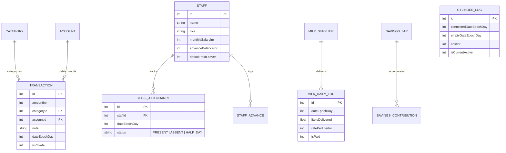

# Offline Room/SQLite Database Schema

Engineered for 100% offline-first execution, fast queries, and zero cloud dependencies.

---



---

## Key Table Definitions

### 1. `TransactionEntity`
```sql
CREATE TABLE transactions (
    id INTEGER PRIMARY KEY AUTOINCREMENT NOT NULL,
    amount_inr INTEGER NOT NULL,          -- Stored in whole rupees (no floating point errors)
    category_id INTEGER NOT NULL,
    account_type TEXT NOT NULL,            -- 'CASH' or 'ONLINE_UPI'
    date_epoch_day INTEGER NOT NULL,      -- LocalDate.toEpochDay() for ultra-fast day indexing
    note TEXT,
    is_private INTEGER NOT NULL DEFAULT 0, -- 1 = Hidden inside Gupt Tijori
    created_at INTEGER NOT NULL
);
CREATE INDEX idx_trans_date ON transactions(date_epoch_day);
```

### 2. `MilkDailyLogEntity`
```sql
CREATE TABLE milk_daily_logs (
    id INTEGER PRIMARY KEY AUTOINCREMENT NOT NULL,
    date_epoch_day INTEGER NOT NULL UNIQUE,
    liters REAL NOT NULL DEFAULT 1.0,      -- e.g. 1.0, 1.5, 0.0 (holiday)
    rate_per_liter INTEGER NOT NULL DEFAULT 66,
    is_month_settled INTEGER NOT NULL DEFAULT 0
);
CREATE INDEX idx_milk_date ON milk_daily_logs(date_epoch_day);
```

### 3. `StaffEntity` & `StaffAttendanceEntity`
```sql
CREATE TABLE staff_members (
    id INTEGER PRIMARY KEY AUTOINCREMENT NOT NULL,
    name TEXT NOT NULL,
    role TEXT NOT NULL,                    -- 'Maid', 'Cook', 'Driver', 'Cleaner'
    monthly_salary_inr INTEGER NOT NULL,
    advance_balance_inr INTEGER NOT NULL DEFAULT 0,
    created_at INTEGER NOT NULL
);

CREATE TABLE staff_attendance (
    id INTEGER PRIMARY KEY AUTOINCREMENT NOT NULL,
    staff_id INTEGER NOT NULL REFERENCES staff_members(id) ON DELETE CASCADE,
    date_epoch_day INTEGER NOT NULL,
    status TEXT NOT NULL,                  -- 'PRESENT', 'ABSENT', 'HALF_DAY'
    UNIQUE(staff_id, date_epoch_day)
);
```

### 4. `CylinderLogEntity`
```sql
CREATE TABLE gas_cylinders (
    id INTEGER PRIMARY KEY AUTOINCREMENT NOT NULL,
    connected_date_epoch_day INTEGER NOT NULL,
    empty_date_epoch_day INTEGER,          -- NULL if currently in use
    cost_inr INTEGER NOT NULL DEFAULT 850,
    is_active INTEGER NOT NULL DEFAULT 1
);
```
