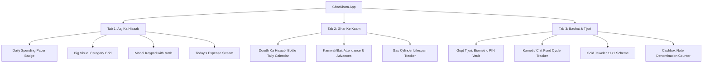

# GharKhata: Complete Expert Recommendations & Implementation Blueprint

---

## 1. Information Architecture: 3-Tab Bottom Navigation

To prevent overwhelming non-tech users, eliminate nested menus, side hamburger drawers, and complex settings. The entire app should live on **3 distinct, high-contrast bottom tabs**:



---

## 2. Screen-by-Screen Minimal-Text Specifications

### Screen 1: "Aaj Ka Hisaab" (Daily Ledger)
* **Top Pacer Card**:
  * Giant number: **₹ 420**
  * Subtitle: *"Aaj ka safe kharcha (Bache hue 14 din)"*
  * Progress Bar: Clean visual line (Green $\rightarrow$ Yellow $\rightarrow$ Rose).
* **Category Grid (8 Big Tiles with 64x64 dp touch areas)**:
  * 🥦 **Sabzi-Phal** (Vegetables & fruits)
  * 🌾 **Kirana / Ration** (Provisions & groceries)
  * 🥛 **Doodh** (Daily dairy)
  * ⛽ **Gas & Bijli** (Utilities)
  * 📚 **Bacche** (School, tuition, stationery)
  * 💊 **Dawai** (Medicines & clinics)
  * 🪔 **Pooja & Shagun** (Gifts & offerings)
  * 👗 **Kapde & Shringar** (Clothing & personal)
* **The Mandi Math Keypad**:
  * Shows running calculation: `40 + 60 + 35 = ₹ 135`
  * Action Button: Big green button spanning the full width: **`[ ✓ Jod Diya ]`**
* **Audio Voice Button**:
  * Microphone icon in the top right corner. Tap $\rightarrow$ speak: *"Sabzi 135 rupaye"* $\rightarrow$ auto-fills and saves with a pleasant chime.

---

### Screen 2: "Ghar Ke Kaam" (Daily Service Helpers)

#### A. Doodh Ka Hisaab (Visual Bottle Grid)
* Calendar view of the current month with milk bottle graphics on each day:
  * **White Bottle**: 1.0 Liter (Default).
  * **Full Blue Bottle**: 1.5 Liters or 2.0 Liters.
  * **Red Cross**: 0.0 Liters (Doodh Bandh).
* **Summary Banner**:
  * Total Liters Delivered: **28.5 L**
  * Rate: **₹ 66 / L**
  * Total Bill: **₹ 1,881**
* **Action Button**:
  * Green WhatsApp icon: *"Doodhwale ko hisaab bhejein"* (Sends pre-formatted WhatsApp message).

#### B. Kamwali / Bai (Payroll & Attendance)
* Card for each helper (e.g. *Sunita Bai - Jhadu Pocha*, *Ramesh - Driver*).
* Monthly calendar with 2 simple buttons:
  * Tap date: Toggles **🟢 Aayi (Present)** vs **🔴 Chhutti (Absent)**.
* Advance Log:
  * `[ + Advance Diya ]` button: select amount (₹500, ₹1000).
* Auto-Calculated Payout on the 1st:
  $$\text{Net Salary} = \left(\frac{\text{Monthly Salary}}{\text{Days in Month}} \times \text{Present Days}\right) - \text{Advance Taken}$$
  * Button: *"WhatsApp Salary Slip Bhejein"*.

#### C. Gas (LPG) Cylinder Tracker
* Visual cylinder graphic showing fill level percentage based on days elapsed.
* Display: *"Lagaye hue 26 din ho gaye (Aamtaur par 36 din chalta hai)"*.
* When 30 days are reached: Prominent alert badge: *"Naya cylinder book karne ka samay aa gaya hai"*.

---

### Screen 3: "Bachat & Tijori" (Savings & Wealth)

#### A. Gupt Tijori (Secret Vault)
* Protected by Fingerprint or 4-digit PIN.
* Never appears on PDF reports or WhatsApp exports.
* Logs cash tucked away in the almirah, emergency funds, or gift money (*Shagun* received).

#### B. Cash Denomination Counter (Galla)
* Stepper buttons for physical currency:
  * `₹500` $\times$ `[ - ] 4 [ + ]` = ₹ 2,000
  * `₹200` $\times$ `[ - ] 3 [ + ]` = ₹ 600
  * `₹100` $\times$ `[ - ] 8 [ + ]` = ₹ 800
  * `₹50`  $\times$ `[ - ] 6 [ + ]` = ₹ 300
  * Total Cash in Hand: **₹ 3,700**

#### C. Kameti / Chit Fund Tracker
* Group Name: *"Society Kitty / Kameti"*
* Monthly Contribution: `₹ 2,000 / month`
* Status: `Month 4 of 10 Paid`
* Payout Month: *"Aapki baari: November 2026 (₹ 20,000 milenge)"*.

#### D. Gold Jeweler 11+1 Scheme
* Scheme: *"Tanishq Golden Harvest / Kalyan Jewellers"*
* Monthly Installment: `₹ 3,000`
* Progress: 8 of 11 installments paid.
* Bonus: 1 month free contribution by jeweler upon maturity.

---

## 3. Mathematical Specifications & Auto-Calculations

| Engine | Inputs | Formula | Output |
| :--- | :--- | :--- | :--- |
| **Aaj Ka Kharcha** | Monthly budget $B$, Total spent so far $S$, Days in month $D_m$, Current day $D_c$ | $\text{Daily Limit} = \frac{B - S}{D_m - D_c + 1}$ | Dynamic daily spending limit in ₹ |
| **Doodh Month Bill** | Daily log array of liters $[L_1, L_2, \dots, L_n]$, Rate per liter $R$ | $\text{Bill} = \left(\sum_{i=1}^{n} L_i\right) \times R$ | Total milkman payout in ₹ |
| **Staff Net Salary** | Base salary $S_{base}$, Days in month $D$, Present days $P$, Advances taken $A$ | $\text{Net} = \left(\frac{S_{base}}{D} \times P\right) - A$ | Exact salary payable on 1st in ₹ |
| **Gas Depletion** | Connected date $T_{start}$, Avg past duration $\bar{D}_{cyl}$ | $\text{Days Left} = \bar{D}_{cyl} - (\text{Today} - T_{start})$ | Remaining days & booking alert |
| **Cashbox Galla** | Note counts $C_{500}, C_{200}, C_{100}, C_{50}, C_{20}, C_{10}$ | $\sum (\text{Denom} \times C_{\text{Denom}})$ | Exact physical cash in almirah/purse |

---

## 4. Voice Input Architecture (Offline & Fast)

To eliminate typing completely, implement an on-device regex-backed voice parser:

```
User Voice Input: "Sabzi ek sau bees rupaye cash"
                │
                ▼
1. Android SpeechRecognizer (EXTRA_PREFER_OFFLINE = true)
                │
                ▼
2. On-Device String: "Sabzi 120 cash"
                │
                ▼
3. Local Regex Tokenizer:
   - Match Category: ["sabzi", "tamatar", "aloo", "bhindi"] -> Category.VEGETABLES
   - Match Number: Extract regex [0-9]+ -> 120
   - Match Mode: ["cash", "rokhad"] -> Account.CASH
                │
                ▼
4. Auto-Insert into Room SQLite (Elapsed time: 180ms)
                │
                ▼
5. Soft Audio Chime + Haptic Feedback
```

---

## 5. Zero-Cost Viral Distribution (WhatsApp Flywheel)

Because the app is **100% free and has no ad budget**, the product must promote itself organically through the daily routines of homemakers:

```
Homemaker uses GharKhata
           │
           ▼
Generates Month-End Slip (Milkman / Bai / Spouse)
           │
           ▼
Shares directly to WhatsApp as a clean Image/Card:
┌──────────────────────────────────────────────┐
│  🥛 Doodh Ka Hisaab (October 2026)           │
│  Total: 29.5 Liters × ₹66 = ₹1,947           │
│  ──────────────────────────────────────────  │
│  Sent via GharKhata — 100% Free & Private   │
│  [Download on Play Store: bit.ly/gharkhata]  │
└──────────────────────────────────────────────┘
           │
           ▼
Recipients (Milkman, Relatives, Friends in Society Groups)
see how clean and convenient it is and download it!
```
