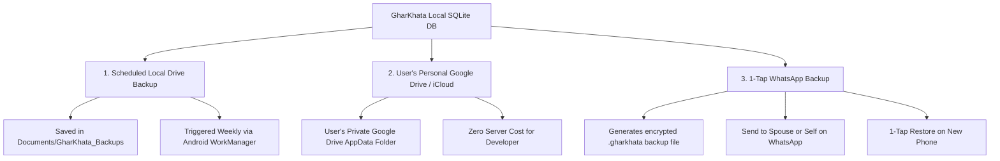

# Offline Multi-Language Support, Data Retention & Backup Strategy

---

## 1. Multi-Language & Vernacular Strategy (100% Offline)

### The "Hinglish" Advantage
Most Indian apps force users to choose between pure English (*"Expenditure / Category / Balance"*) or pure Shuddh Hindi (*"व्यय / श्रेणी / शेष राशि"*). In reality, millions of Indian homemakers speak and text in **Hinglish**:
* English: *"Add Expense"*
* Hindi: *"व्यय जोड़ें"*
* **Hinglish (Most Natural)**: *"Kharcha Jodein"* / *"Aaj Ka Hisaab"* / *"Doodh Ka Bill"*

### Language Roster & Storage Impact
All strings are bundled directly into the local app binary (via Compose Multiplatform `Res.string` or localized XML/strings files). **Zero internet is required to switch or render languages.**

| Language | Script | Example (Daily Safe Spend) | Bundle Size |
| :--- | :--- | :--- | :--- |
| **Hinglish** | Latin | *Aaj ka bacha hua safe kharcha* | ~28 KB |
| **Hindi (हिन्दी)** | Devanagari | *आज का सुरक्षित खर्च* | ~32 KB |
| **English** | Latin | *Today's safe spending limit* | ~26 KB |
| **Marathi (मराठी)** | Devanagari | *आजचा सुरक्षित खर्च* | ~32 KB |
| **Gujarati (ગુજરાતી)** | Gujarati | *આજનો સુરક્ષિત ખર્ચ* | ~34 KB |
| **Tamil (தமிழ்)** | Tamil | *இன்றைய செலவு வரம்பு* | ~36 KB |
| **Telugu (తెలుగు)** | Telugu | *ఈ రోజు ఖర్చు పరిమితి* | ~36 KB |
| **Bengali (বাংলা)** | Bengali | *আজকের খরচের সীমা* | ~34 KB |
| **Kannada (ಕನ್ನಡ)** | Kannada | *ಇಂದಿನ ಖರ್ಚಿನ ಮಿತಿ* | ~36 KB |

*Total overhead for 9 languages:* **< 350 KB** (negligible).

### In-App Dynamic Language Switcher
* Users can change the app language from the top bar with 1 tap at any time, **without altering their system-wide phone language**.
* Preference is persisted in local key-value storage (`DataStore` on Android, `UserDefaults` on iOS).

### Offline Speech-to-Text in Indian Languages
* **Android**: Uses `android.speech.SpeechRecognizer` with on-device language models (`Locale("hi-IN")`, `Locale("ta-IN")`, `Locale("en-IN")`).
* **iOS**: Native `SFSpeechRecognizer` on-device dictation models.
* No audio is sent to third-party cloud servers; voice processing occurs entirely on the device processor.

---

## 2. 100% Data Retention & Zero-Data-Loss Architecture

Following the safety standards established in TutorHQ:

### A. Non-Destructive Forward Database Migrations
* Database schema upgrades never drop tables. Every schema change is registered as an explicit migration step:
  ```kotlin
  val MIGRATION_1_2 = object : Migration(1, 2) {
      override fun migrate(db: SupportSQLiteDatabase) {
          db.execSQL("ALTER TABLE transactions ADD COLUMN payment_mode TEXT NOT NULL DEFAULT 'CASH'")
      }
  }
  ```

### B. Pre-Update Automatic Database Snapshots
* Before the database executes any migration during an app update, the existing `.db` file is cloned into an internal `snapshots/` folder (`gharkhata_snapshot_v1.db`). If an upgrade fails, the app automatically rolls back without data corruption.

### C. Soft-Delete (Zero Destruction)
* When a user removes a category, a helper, or an old milk record, the app marks `is_active = 0` instead of running `DELETE FROM`. Historical expenses and year-end totals remain 100% intact.

---

## 3. Backup & Restore Architecture (Zero Developer Cloud Cost)

Because the app is **100% free with no backend servers**, backups use local storage, the user's private cloud accounts, and WhatsApp:



### 1. Local Drive Backups (Automated & Scheduled)
* **Frequency**: Automated weekly snapshots using Android `WorkManager` (and iOS `BGAppRefreshTask`) while the phone is idle and charging.
* **Storage Location**:
  * Android: `Documents/GharKhata_Backups/`
  * iOS: Files App $\rightarrow$ `On My iPhone/GharKhata/Backups/`
* **Formats Generated**:
  1. `GharKhata_Backup_[Date].db` (Exact SQLite binary for instant 1-tap restore).
  2. `GharKhata_Export_[Date].json` (Open, cross-platform human-readable JSON).
  3. `GharKhata_Expenses_[Year].csv` (For Excel viewing if desired).

### 2. User's Personal Google Drive / iCloud (Zero Cloud Cost for Developer)
* Instead of maintaining an expensive AWS/Firebase server, the app connects directly to the user's **own Google Drive or iCloud**:
  * **Google Drive AppData Folder**: Stores encrypted backups in the private `appDataFolder` on the user's Google Drive. It doesn't clutter their regular Drive view and cannot be accidentally deleted by other apps.
  * **iCloud Drive**: Native iOS CloudKit/Ubiquity storage inside the app's secure container.
* **Cost to Developer**: **$0.00 forever**.
* **Privacy**: Only the user holds the encryption key; no third party can read their household data.

### 3. The WhatsApp Share Backup (The Indian Homemaker Superpower)
* Homemakers rely heavily on WhatsApp.
* **Workflow**:
  1. Tap *"Backup to WhatsApp"*.
  2. The app compresses and encrypts the SQLite database into a single lightweight file: `GharKhata_2026_10_01.gharkhata` (< 500 KB).
  3. Android/iOS Share Sheet opens directly with WhatsApp selected.
  4. She sends the file to herself, her spouse, or a family group.
* **Restoring on a New Phone**:
  * Download GharKhata on new phone $\rightarrow$ Tap the `.gharkhata` file in WhatsApp $\rightarrow$ GharKhata opens and restores all records in 1 second.

---

## 4. Additional Offline Utility Modules

### A. Important Family & Emergency Contacts Card
* Offline directory of essential local services:
  * Family Pediatrician / Doctor
  * LPG Gas Agency Delivery Boy
  * Local Kirana Store (Home Delivery WhatsApp Number)
  * Society Plumber & Electrician
  * School Van / Bus Driver

### B. Offline PDF Receipt & Statement Generator
* Pure vector rendering on ISO A4 canvas (`android.graphics.pdf.PdfDocument` on Android, `UIGraphicsPDFRenderer` on iOS).
* Generates crisp, printable month-end household summaries with zero watermarks and zero third-party branding.
